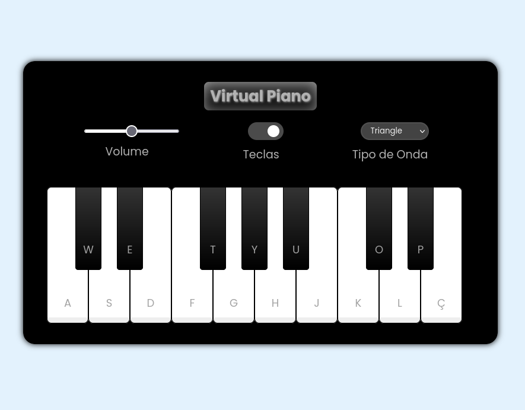

# 🎹 Virtual Piano

O **Virtual Piano** é um piano interativo desenvolvido para ser usado diretamente no navegador. 
Este projeto utiliza HTML, CSS e JavaScript, além da Web Audio API para gerar sons em tempo real.

## 🛠️ Funcionalidades

- **Toque com o teclado**: Use as teclas mapeadas para tocar notas no piano.
- **Controle de volume**: Ajuste o volume usando o controle deslizante.
- **Sustain**: Notas continuam enquanto a tecla está pressionada.
- **Customização de timbre**: Escolha entre diferentes tipos de ondas sonoras (`sine`, `square`, `sawtooth`, `triangle`).
- **Alternar labels**: Mostre ou oculte as letras das teclas no piano.

### Interações:
- **Teclado**: Pressione as teclas mapeadas para tocar notas.
- **Mouse**: Clique nas teclas do piano.
- **Sustain**: Mantenha pressionada a tecla para prolongar o som.
- **Customizar som**: Alterne o tipo de onda no menu suspenso no cabeçalho.

### Sobre a API:

- **Site**: https://developer.mozilla.org/en-US/docs/Web/API/Web_Audio_API

A Web Audio API é uma ferramenta poderosa para criar experiências de áudio dinâmicas na web. Ela permite:

- **Processar áudio em tempo real com alta qualidade.** -
- **Criar sons sintetizados com osciladores.** -
- **Manipular arquivos de áudio gravados.** -
- **Aplicar efeitos como eco, reverberação e filtros.** -
- **Controlar o volume, o panorama e outros parâmetros de áudio.** -

No projeto atual, a API é usada para criar um piano virtual, onde as teclas são mapeadas para frequências específicas. Ao pressionar uma tecla ou clicar no piano, a API gera sons sintéticos usando osciladores.

## Demonstração



## 📂 Estrutura do projeto

```
Virtual Piano/
.
├── index.html      # HTML Arquivo principal do projeto
├── src/
│   ├── styles/
│   │   ├── reset.css  # Estilos globais
│   │   └── main.css   # Estilos específicos do piano
│   └── scripts/
│       └── engine.js  # Lógica do piano
├── README.md              # Documentação do projeto
└── demo-image.png         # Imagem de demonstração do piano
```
## 🧑‍💻 Tecnologias utilizadas

- **HTML5**: Estrutura básica do projeto.
- **CSS3**: Estilização das teclas e layout geral.
- **JavaScript**: Lógica para interação e geração de sons.
- **Web Audio API**: Geração de áudio em tempo real.

**Divirta-se tocando música no navegador!** 🎶
